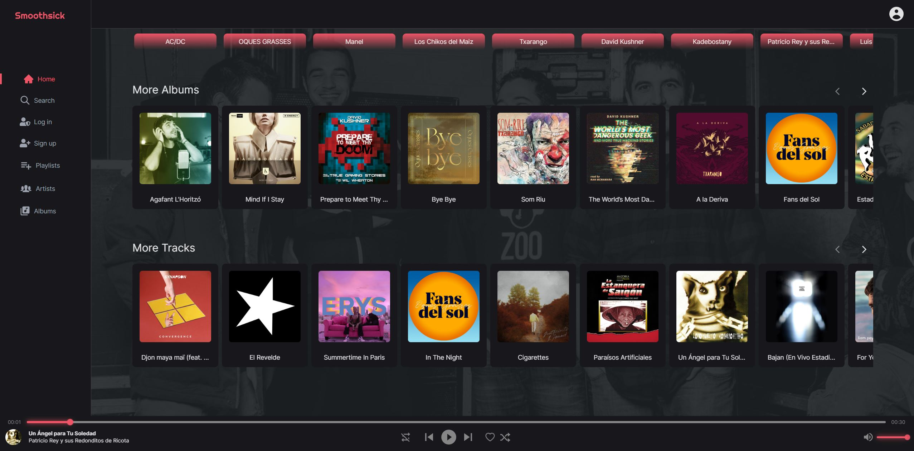
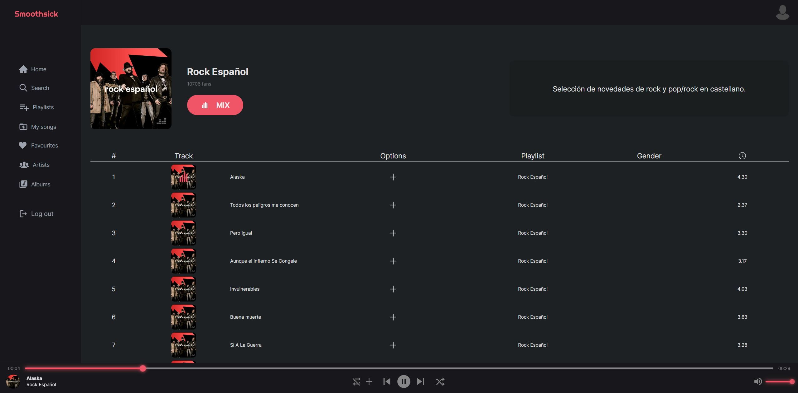
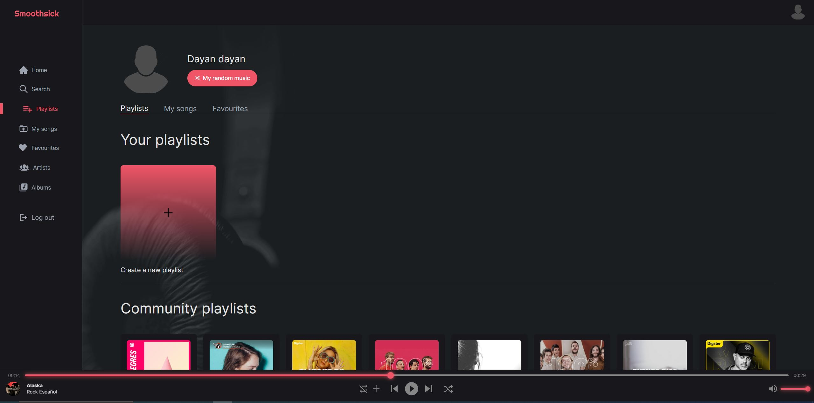
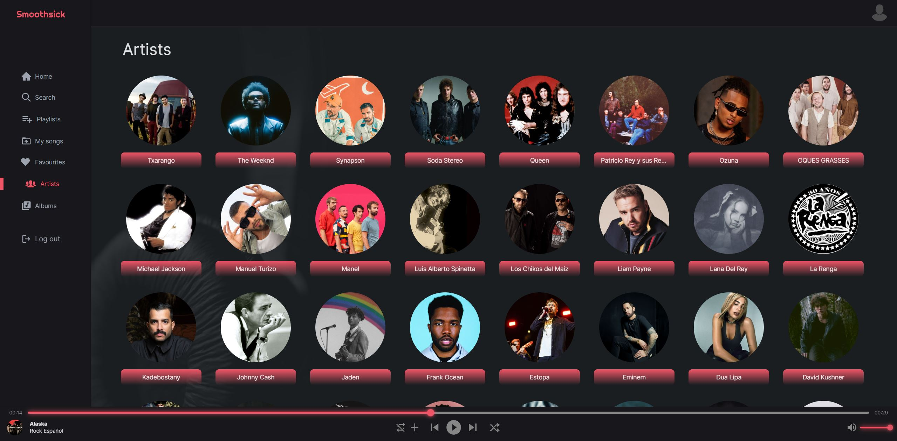
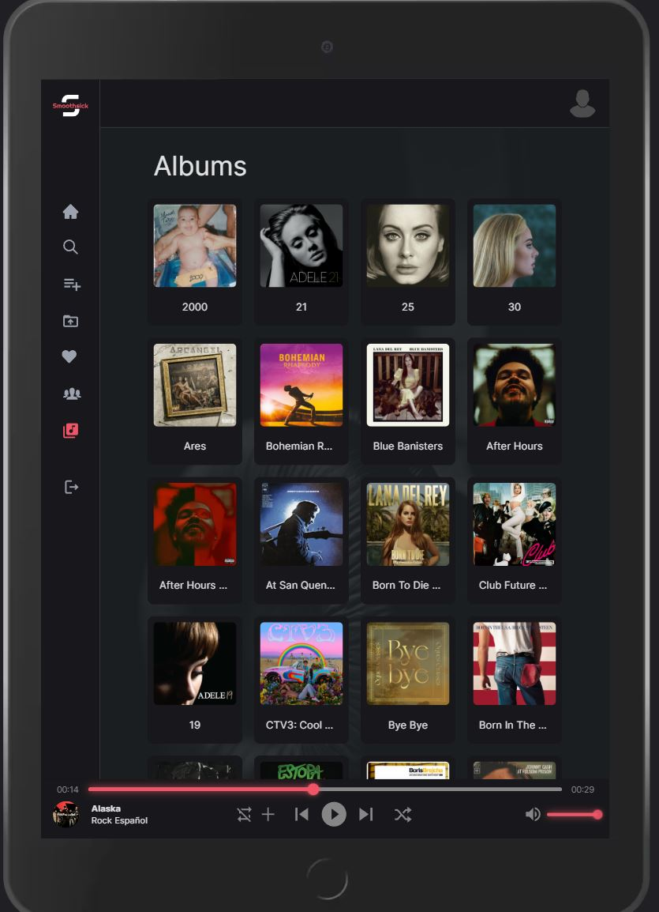
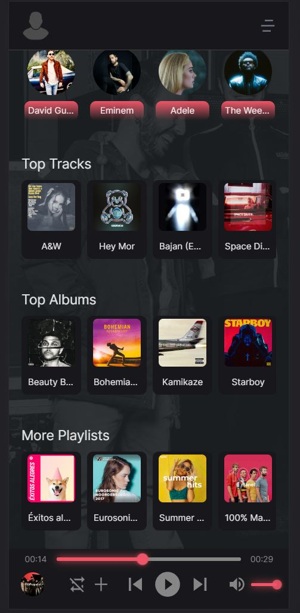
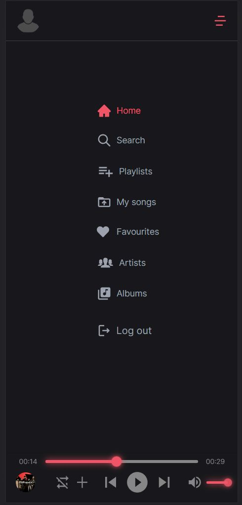

# Smoothsick Backend

This project is based on the page <a href="https://deezer.com">Deezer</a> and mocks the music platform implemented by this page, trying with this to improve my knowledge of react and another related libraries.\
 

 

 

 

 

 

 

 

This web application uses on <u><i>backend</i></u>:

<b><ul>

  <li>Node.js</li>
  <li>Express.js</li>
  <li>MongoDb</li>
  <li>Axios</li>
  <li>Bcrypt</li>
  <li>Cloudinary</li>
  <li>Express-fileupload</li>
  <li>Wiston</li>
  <li>Nodemailer</li>
  <li>Jsonwebtoken</li>
  <li>Dotenv</li>
  <li>Mongoose</li>
  <li>Chalk</li>
  <li>Morgan</li>
  <li>Typescript</li>

</ul></b>
 

You can visit this page through this link ✈️ <a>https://smoothsick.arcprojects.es</a>\
 

👩‍🚀 I hope you enjoy it! 🚀

 
(●'◡'●) (●'◡'●) (●'◡'●)

## Convenciones del Repositorio
El modo de desarrollo de este proyecto sigue las siguientes convenciones:

Crear rama con la siguiente nomenclatura:
- `feat/add-branch-name`
- `refactor/add-branch-name`
- `test/add-branch-name`
- `chore/add-branch-name`

Los commits seguirán la siguiente convención:
- `feat: this is my commit`
- `internal: commit`
- `chore: commit`

> [!TIP]
> **Flujo:** Una vez terminada la rama, abrir Pull Request (se recomienda en modo borrador) para verificar la build mediante un workflow automático de GitHub Actions. Tras el merge exitoso, se recomienda eliminar la rama de trabajo.

---

## Entorno de Desarrollo
Para poder lanzar el proyecto, se requiere configurar las siguientes variables de entorno antes del arranque:

* `NODE_ENV=production`
* `PORT=4000`
* `DB_URI=uri`
* `CLOUDINARY_NAME=name`
* `CLOUDINARY_KEY=key`
* `CLOUDINARY_SECRET=secret`
* `FRONT_URI=http://host:port`
* `MIGRATIONS_URI="path/to/migrations/files"`
* `JWT_SECRET=jwtSecret`

## Generar Versión
En caso de estar listo para sacar una nueva versión:
1. Desplazarse a **GitHub Actions - Release**.
2. Iniciar el proceso seleccionando **Run Workflow**.

Este proceso generará una nueva versión en el proyecto, subirá la imagen actualizada al repositorio de **Docker Hub** y creará una release oficial en GitHub.

---

## Infrastructura y Despliegue

* **📦 GitOps Repository:** [🚀 `stack/smoothsick`](https://github.com/devs-toni/Infrastructure-gitops/tree/main/src/web-server/stacks/smoothsick)
* **🐳 Docker Hub:** [devstoni/smoothsick-api](https://hub.docker.com/repository/docker/devstoni/smoothsick-api/general)

La aplicación dispone de repositorio público en Docker Hub, desde donde se va versionando para obtener el paquete en producción.
